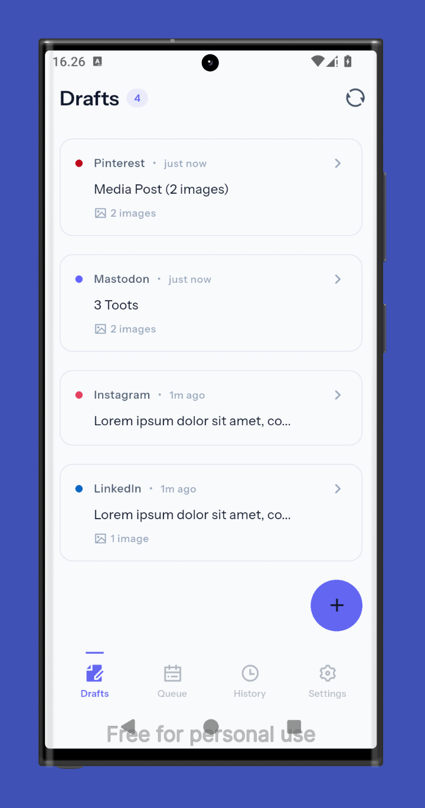
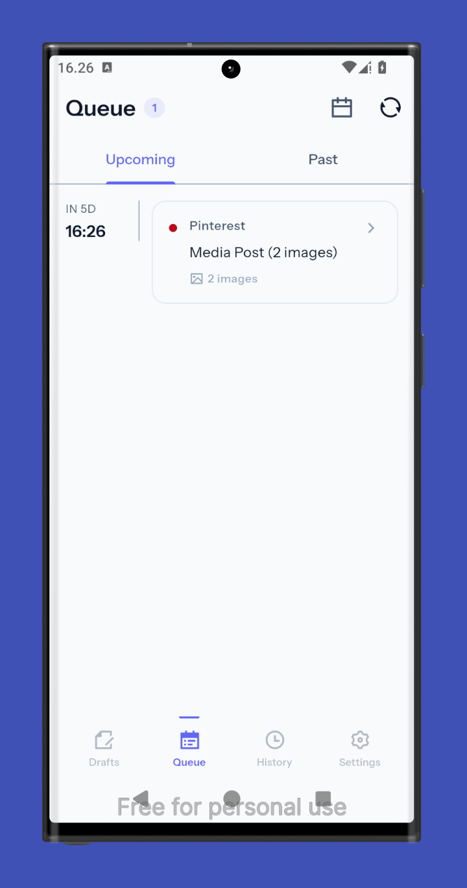
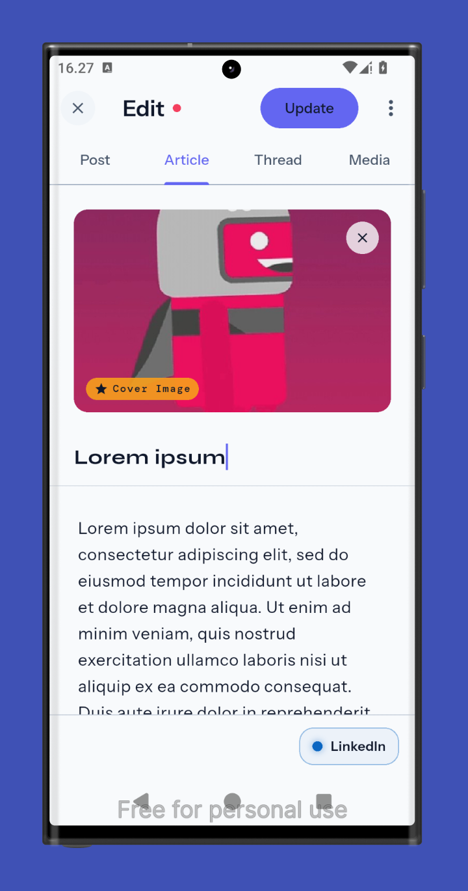
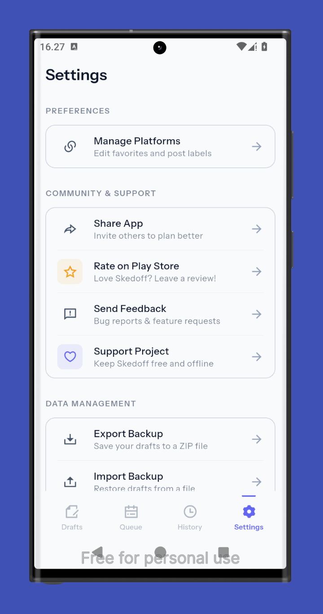

# Skedoff

**Plan offline. Post when ready.**

> A privacy-first, offline-first social media content planner.  
> No account. No cloud. No subscription. Just your drafts — waiting for the right moment.

[Why Skedoff](#why-skedoff) · [Features](#features) · [Screenshots](#screenshots) · [Platforms](#platforms) · [Roadmap](#roadmap)

---

## Why Skedoff?

Most content schedulers want you to:

- Create an account
- Connect your social handles
- Pay monthly
- Hand over your content to a server you don't control

**Skedoff does none of that.**

Write your posts offline. Tag the platform. Mark your status. When you're ready — open, copy, paste, publish. Your drafts live on your device. Full stop.

---

## Three Tabs. One Flow.

Skedoff is built around a single, distraction-free workflow:

| Tab           | Purpose                                                |
| ------------- | ------------------------------------------------------ |
| **Draft**     | Where ideas land. Write freely, no pressure.           |
| **Queue**     | Content you've decided to post — lined up and waiting. |
| **Published** | Your record of what went out and when.                 |

Move a post from Draft → Queue → Published at your own pace. No automation. No auto-posting. You're always in control.

---

## Features

### Core

- **Fully offline** — works with zero internet, always
- **No account required** — open the app, start writing
- **No cloud sync** — all data lives in Isar local database on your device
- **Multi-platform support** — Android, iOS, Windows, macOS, Linux
- **Platform tagging** — assign posts to Instagram, X/Twitter, LinkedIn, TikTok, Threads, Facebook, YouTube, Bluesky, and more
- **Status tracking** — move drafts through Draft → Queue → Published

### Writing

- Hashtag and mention highlighting in the editor
- Multi-line caption support
- Media attachment notes — remind yourself what image goes with what post
- Template drafts — reusable post structures for recurring content

### Organization

- Filter by platform, status, or date range
- Search drafts
- Export drafts as `.db`

### Privacy

- Zero telemetry
- No analytics
- No crash reporting (opt-in only, future version)
- Local data only — nothing leaves your device

---

## Screenshots

| Draft Tab                       | Queue Tab                       | Editor                            | Settings                           |
| ------------------------------- | ------------------------------- | --------------------------------- | ---------------------------------- |
|  |  |  |  |

---

## Platforms

| Platform    | Status         | Min Version          | Download                                                                                    |
| :---------- | :------------- | :------------------- | :------------------------------------------------------------------------------------------ |
| **Android** | ✅ Active      | Android 6.0 (API 23) | [**Get on Play Store**](https://play.google.com/store/apps/details?id=com.flagodna.skedoff) |
| **iOS**     | 🔄 Planned     | iOS 14.0             | —                                                                                           |
| **Windows** | 🔄 Planned     | Windows 10           | —                                                                                           |
| **macOS**   | ❌ Not planned | macOS 11             | —                                                                                           |
| **Linux**   | 🔄 Planned     | Ubuntu 20.04+        | —                                                                                           |
| **Web**     | ❌ Not planned | —                    | —                                                                                           |

Web is intentionally excluded. Skedoff is a **device-native** app — offline-first means it belongs on your device.

---

## Send Feedback?

Have a bug to report or a feature you'd love to see? We're building **Skedoff** in the open and your input helps us keep it truly creator-first.

- **Bug Reports & Feature Requests:** Open an issue on [**GitHub Issues**](https://github.com/flagodna-developer/skedoff/issues/new) (Recommended).
- **General Inquiries:** Feel free to reach out via email at [**flagodna.com@gmail.com**](mailto:flagodna.com@gmail.com).

> **Pro Tip:** When reporting a bug on GitHub, please include your device model and Android version to help us fix it faster.

---

## Roadmap

### v1.0.0 — MVP

- [x] Design system
- [x] Project scaffold
- [x] Draft CRUD (create, read, update, delete)
- [x] Three-tab layout — Draft, Queue, Published
- [x] Platform tagging
- [x] Status management (Draft → Queue → Published)
- [x] Android Released

### v1.1.0 — Reminders

- [ ] Local notification reminders for queued posts
- [ ] Bulk actions — delete, move, or change status
- [ ] Share drafts to Skedoff

---

## Privacy Policy

Skedoff collects **zero user data**.

- No analytics
- No crash reporting (opt-in only, future version)
- No network requests from the app itself
- No third-party SDKs that collect data
- All data stored locally via Isar

---

## About

Skedoff is built by **[FlagoDNA](https://flagodna.com)** — a solo digital studio building privacy-first tools since 2020.

> _"Mlampah Ing Tresno"_ — Walk in Love.

---

Made with intention · No cloud required · Your content, your device

